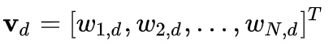

# Vector Space Model

El modelo de espacio vectorial es un modelo algebraico para representar documentos (o cualquier objeto en general) como vectores. 

Cada dimensión corresponde con un término separado. Si el término ocurre en el documento, su valor es distinto de cero. Multitud de formas de calcular estos valores, también conocidos como pesos de los términos, han sido desarrolladas. Uno de los mejores esquemas es el `TF-IDF`.

La definición de término depende de la aplicación. Típicamente son solo palabras, palabras claves o frases. Si son palabras las escogidas como términos, entonces la dimensión de los vectores será el número de palabras en el vocabulario o corpus.

Operaciones vectoriales pueden ser utilizadas para comparar documentos con queries.

## Aplicaciones

Las clasificaciones de relevancia de los documentos en una búsqueda por palabra clave se pueden calcular utilizando los supuestos de la teoría de similitudes de documentos, comparando la desviación de ángulos entre cada vector de documento y el vector de consulta original; donde la consulta se representa como un vector con la misma dimensión que los vectores que representan los otros documentos.

En la práctica, es más fácil calcular el coseno del ángulo entre los vectores, en lugar del propio ángulo:

Donde *d2 * q* es la intersección (conocida es como producto del punto) del documento (d2) y la query (q). *||d2||* es la norma del vector d2 y *||q||* es la norma del vector q. La norma se calcula de la siguiente manera:

Usando el coseno, la similitud entre el documento dj y la consulta q se puede calcular como:

Como todos los vectores considerados por este modelo son elementos no negativos, un valor de coseno de cero significa que el vector de consulta y documento son ortogonales y no tienen coincidencia (es decir, el término de consulta no existe en el documento que se está considerando).

## TF-IDF

El vector de un documento de acuerdo al peso otorgado por el `TF-IDF` sería: , donde:

y:

- tf(t, d) es la frecuencia del término t en el documento d (es un parámetro local).

-  es el inverse document frequency (IDF, un parámetro global). Donde *|D|* es la cantidad total de documentos existentes y  son la cantidad de documentos que contienen al término t.

## Bibliografía

- Wikipedia: [https://en.wikipedia.org/wiki/Vector_space_model](https://en.wikipedia.org/wiki/Vector_space_model).
- Machine Learning :: Text feature extraction (tf-idf) – Part I: [https://blog.christianperone.com/2011/09/machine-learning-text-feature-extraction-tf-idf-part-i/](https://blog.christianperone.com/2011/09/machine-learning-text-feature-extraction-tf-idf-part-i/).
- Machine Learning :: Text feature extraction (tf-idf) – Part II: [https://blog.christianperone.com/2011/10/machine-learning-text-feature-extraction-tf-idf-part-ii/](https://blog.christianperone.com/2011/10/machine-learning-text-feature-extraction-tf-idf-part-ii/).
- Machine Learning :: Text feature extraction (tf-idf) – Part III: [https://blog.christianperone.com/tag/vector-space-model/](https://blog.christianperone.com/tag/vector-space-model/).